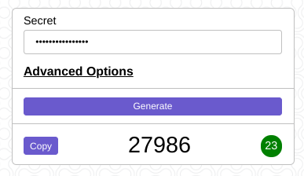

# TOTP Web Generator

Generate [TOTP](https://en.wikipedia.org/wiki/Time-based_One-Time_Password) codes right from your browser for Two-Factor Authentication (2FA). Compatible with authenticator applications like [Google Authenticator](https://play.google.com/store/apps/details?id=com.google.android.apps.authenticator2&hl=en_IN&gl=US), [Authy](https://authy.com/) and [Microsoft Authenticator](https://www.microsoft.com/en-in/account/authenticator).

Demo,
* [Netlify](https://www.netlify.com/): [totp.maverickgeek.xyz](https://totp.maverickgeek.xyz/)
* [CloudFlare](https://cloudflare.com): [totp-generator-web.pages.dev](https://totp-generator-web.pages.dev/)



## Design

The application only uses the JavaScript APIs provided by the browser. It consists of only a single HTML file, which allows it to work offline by running it from disk. The design allows it to work without installation and in environments like [Tails](https://tails.boum.org/).

**Assumption:** Possible to input the TOTP key into the web application's input field. (e.g, Copy/Paste or Manual typing using a hardware/virtual keyboard based on the threat model).

## Settings

The default settings are compatible with Google Authenticator,

* HMAC Algorithm: SHA-1
* Period: 30 seconds
* Digits: 6

Use the “Advanced Options” menu to change the above values.

The application supports secret keys in the following formats,
* Base32 (case-insensitive) — e.g, XY7MXDNK5ZEKJT4Y or xy7mxdnk5zekjt4y
* Base32 with spaces (case-insensitive) — e.g, g5od kqdo hqkd 4kup qr2d txc2 2cfh wylh

## Web Technologies Used

1. [Web Crypto](https://developer.mozilla.org/en-US/docs/Web/API/Web_Crypto_API) — Used to calculate the HMAC. [Browser Support](https://caniuse.com/cryptography).
2. [Uint8Array](https://developer.mozilla.org/en-US/docs/Web/JavaScript/Reference/Global_Objects/Uint8Array) — Used to store and process binary data according to [RFC 6238 (TOTP)](https://tools.ietf.org/html/rfc6238) and [RFC 4226 (HOTP)](https://tools.ietf.org/html/rfc4226). [Browser Support](https://caniuse.com/mdn-javascript_builtins_uint8array).
3. [Async/Await](https://developer.mozilla.org/en-US/docs/Web/JavaScript/Reference/Statements/async_function) — Easier to work with promises. [Browser Support](https://caniuse.com/async-functions).
4. [Custom Elements](https://developer.mozilla.org/en-US/docs/Web/Web_Components/Using_custom_elements) — Build the UI out of components without a JavaScript framework. [Browser Support](https://caniuse.com/custom-elementsv1).

## Development

### Tools

-   [ESLint](https://eslint.org/) — JavaScript linter
-   [Prettier](https://prettier.io/) — Code formatting
-   [Live Server](https://github.com/tapio/live-server) — Auto-reload on changes to `site/index.html`
-   [Visual Studio Code](https://code.visualstudio.com/) — Code editor with [ESLint](https://marketplace.visualstudio.com/items?itemName=dbaeumer.vscode-eslint) and [Prettier](https://marketplace.visualstudio.com/items?itemName=esbenp.prettier-vscode) extensions.

[Content Security Policy](https://content-security-policy.com/hash/) whitelists assets that can be run. The whitelist identifies assets by their SHA-256 hash, which is updated by a minimal build tool (watch.js). A [meta tag](https://content-security-policy.com/examples/meta/) is the preferred method of policy configuration as [Netlify](https://www.netlify.com/) hosts the site.

Use the following command to start the build tool which watches for changes to `src/index.html`,
```
$ npm run watch
```

Use the following command to start live-server,
```
$ npm run start
```

### Environment

Get started working on this repository from your browser using [Gitpod](https://gitpod.io). Click on the button below to create a GitPod environment, <br />

[](https://gitpod.io/#https://github.com/k3karthic/totp-generator-web)

### Code Mirrors

* GitHub: [github.com/k3karthic/totp-generator-web](https://github.com/k3karthic/totp-generator-web/)
* Codeberg: [codeberg.org/k3karthic/totp-generator-web](https://codeberg.org/k3karthic/totp-generator-web)

## Deployment

Development happens on the devel branch and merged with main for a release.  A GitHub build hook pushes a new version for every update of the main branch using the contents of the dist folder. Netlify and CloudFlare host the site.

Use the following command to update the `dist` folder. The command removes CSP configurations which are only required for development.
```
$ npm run build
```

## Acknowledgements

References used during development,

-   [bellstrand/totp-generator](https://github.com/bellstrand/totp-generator) — Reference TOTP implementation
-   [RFC 6238 (TOTP)](https://tools.ietf.org/html/rfc6238)
-   [RFC 4226 (HOTP)](https://tools.ietf.org/html/rfc4226)
-   [Background Pattern](https://www.toptal.com/designers/subtlepatterns/double-bubble-outline-pattern/) — Background pattern by [Tomislava Babić](https://behance.net/antitomi)
